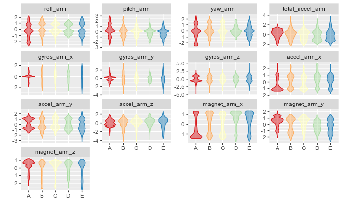
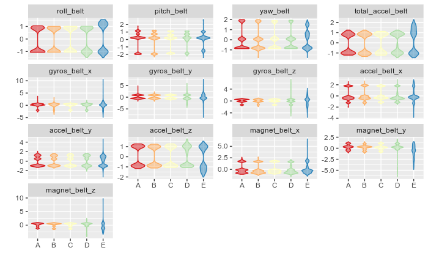
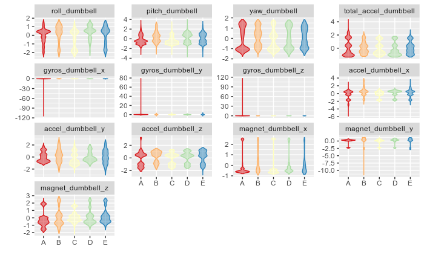
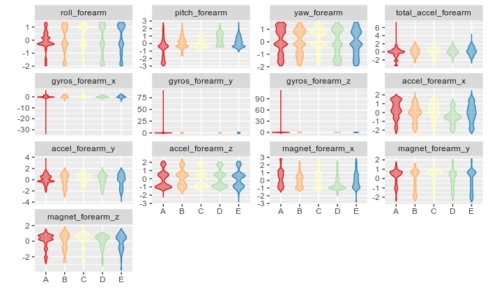

# Practical Machine Learning Assignment

Created by Hiran Hasanka

[Github](https://github.com/theSLWayne)
[Twitter](https://twitter.com/theSLWayne)
[LinkedIn](https://linkedin.com/in/hiran-hasanka)
[Medium](https://medium.com/@hiranhasanka)

```
# Compiled on 3rd of June, 2020.
# R version 4.0.0 (2020-04-24) -- "Arbor Day"
```

## Background on the Dataset

> Using devices such as Jawbone Up, Nike FuelBand, and Fitbit it is now possible to collect a large amount of data about personal activity relatively inexpensively. These type of devices are part of the quantified self movement – a group of enthusiasts who take measurements about themselves regularly to improve their health, to find patterns in their behavior, or because they are tech geeks. One thing that people regularly do is quantify how much of a particular activity they do, but they rarely quantify how well they do it. In this project, your goal will be to use data from accelerometers on the belt, forearm, arm, and dumbell of 6 participants. They were asked to perform barbell lifts correctly and incorrectly in 5 different ways. More information is available from the website here (see the section on the Weight Lifting Exercise Dataset).

## Data

> The training data for this project are available [here](https://d396qusza40orc.cloudfront.net/predmachlearn/pml-training.csv).

> The test data are available [here](https://d396qusza40orc.cloudfront.net/predmachlearn/pml-testing.csv).

## Loading Datasets

Package "readr" will be used for loading .csv files.

```r
library(readr)

WL <- read_csv("data/pml-training.csv")
WLTest <- read_csv("data/pml-testing.csv")
```

Trying to gain a basic understanding about what we’re dealing with here.

```r
dim(WL)
```

```
[1] 19622   160
```

So, We’ve got a dataset of about 20K records and 160 possible predictors. Since the models do not work well with missing values, I’m trying to find whether there are any predictors without a single missing value. I’ve used [this method](https://stackoverflow.com/questions/11330138/find-columns-with-all-missing-values/11330265#11330265) to find columns with at least one missing value.

```r
anyMissingVals <- sapply(WLTest, function(x) any(is.na(x) | x == ""))
# Taking a look at possible predictors that do not have any missing values
names(WLTest)[!anyMissingVals]
```

```
 [1] "X1"                   "user_name"            "raw_timestamp_part_1"
 [4] "raw_timestamp_part_2" "cvtd_timestamp"       "new_window"          
 [7] "num_window"           "roll_belt"            "pitch_belt"          
[10] "yaw_belt"             "total_accel_belt"     "gyros_belt_x"        
[13] "gyros_belt_y"         "gyros_belt_z"         "accel_belt_x"        
[16] "accel_belt_y"         "accel_belt_z"         "magnet_belt_x"       
[19] "magnet_belt_y"        "magnet_belt_z"        "roll_arm"            
[22] "pitch_arm"            "yaw_arm"              "total_accel_arm"     
[25] "gyros_arm_x"          "gyros_arm_y"          "gyros_arm_z"         
[28] "accel_arm_x"          "accel_arm_y"          "accel_arm_z"         
[31] "magnet_arm_x"         "magnet_arm_y"         "magnet_arm_z"        
[34] "roll_dumbbell"        "pitch_dumbbell"       "yaw_dumbbell"        
[37] "total_accel_dumbbell" "gyros_dumbbell_x"     "gyros_dumbbell_y"    
[40] "gyros_dumbbell_z"     "accel_dumbbell_x"     "accel_dumbbell_y"    
[43] "accel_dumbbell_z"     "magnet_dumbbell_x"    "magnet_dumbbell_y"   
[46] "magnet_dumbbell_z"    "roll_forearm"         "pitch_forearm"       
[49] "yaw_forearm"          "total_accel_forearm"  "gyros_forearm_x"     
[52] "gyros_forearm_y"      "gyros_forearm_z"      "accel_forearm_x"     
[55] "accel_forearm_y"      "accel_forearm_z"      "magnet_forearm_x"    
[58] "magnet_forearm_y"     "magnet_forearm_z"     "problem_id"         
```

Looks like the predictors whose name include “belt”, “dumbbell”, “forearm” and “arm” do not have missing values. So I’m going to select those as predictors.

```r
isPred <- !anyMissingVals & grepl("belt|[^(fore)]arm|dumbbell|forearm", names(WLTest))
preds <- names(WLTest)[isPred]
preds
```

```
 [1] "roll_belt"            "pitch_belt"           "yaw_belt"            
 [4] "total_accel_belt"     "gyros_belt_x"         "gyros_belt_y"        
 [7] "gyros_belt_z"         "accel_belt_x"         "accel_belt_y"        
[10] "accel_belt_z"         "magnet_belt_x"        "magnet_belt_y"       
[13] "magnet_belt_z"        "roll_arm"             "pitch_arm"           
[16] "yaw_arm"              "total_accel_arm"      "gyros_arm_x"         
[19] "gyros_arm_y"          "gyros_arm_z"          "accel_arm_x"         
[22] "accel_arm_y"          "accel_arm_z"          "magnet_arm_x"        
[25] "magnet_arm_y"         "magnet_arm_z"         "roll_dumbbell"       
[28] "pitch_dumbbell"       "yaw_dumbbell"         "total_accel_dumbbell"
[31] "gyros_dumbbell_x"     "gyros_dumbbell_y"     "gyros_dumbbell_z"    
[34] "accel_dumbbell_x"     "accel_dumbbell_y"     "accel_dumbbell_z"    
[37] "magnet_dumbbell_x"    "magnet_dumbbell_y"    "magnet_dumbbell_z"   
[40] "roll_forearm"         "pitch_forearm"        "yaw_forearm"         
[43] "total_accel_forearm"  "gyros_forearm_x"      "gyros_forearm_y"     
[46] "gyros_forearm_z"      "accel_forearm_x"      "accel_forearm_y"     
[49] "accel_forearm_z"      "magnet_forearm_x"     "magnet_forearm_y"    
[52] "magnet_forearm_z"    
```

With that having done, I’m going to create a subset of the primary dataset including only “preds” columns and “classe” column.

```r
preds <- c("classe", preds)
WL <- WL[, preds, with = F]
dim(WL)
```

```
[1] 19622    53
```

Taking a quick look at the new dataset

```r
sapply(WL, class)
```

```
           classe            roll_belt           pitch_belt             yaw_belt 
         "character"            "numeric"            "numeric"            "numeric" 
    total_accel_belt         gyros_belt_x         gyros_belt_y         gyros_belt_z 
           "numeric"            "numeric"            "numeric"            "numeric" 
        accel_belt_x         accel_belt_y         accel_belt_z        magnet_belt_x 
           "numeric"            "numeric"            "numeric"            "numeric" 
       magnet_belt_y        magnet_belt_z             roll_arm            pitch_arm 
           "numeric"            "numeric"            "numeric"            "numeric" 
             yaw_arm      total_accel_arm          gyros_arm_x          gyros_arm_y 
           "numeric"            "numeric"            "numeric"            "numeric" 
         gyros_arm_z          accel_arm_x          accel_arm_y          accel_arm_z 
           "numeric"            "numeric"            "numeric"            "numeric" 
        magnet_arm_x         magnet_arm_y         magnet_arm_z        roll_dumbbell 
           "numeric"            "numeric"            "numeric"            "numeric" 
      pitch_dumbbell         yaw_dumbbell total_accel_dumbbell     gyros_dumbbell_x 
           "numeric"            "numeric"            "numeric"            "numeric" 
    gyros_dumbbell_y     gyros_dumbbell_z     accel_dumbbell_x     accel_dumbbell_y 
           "numeric"            "numeric"            "numeric"            "numeric" 
    accel_dumbbell_z    magnet_dumbbell_x    magnet_dumbbell_y    magnet_dumbbell_z 
           "numeric"            "numeric"            "numeric"            "numeric" 
        roll_forearm        pitch_forearm          yaw_forearm  total_accel_forearm 
           "numeric"            "numeric"            "numeric"            "numeric" 
     gyros_forearm_x      gyros_forearm_y      gyros_forearm_z      accel_forearm_x 
           "numeric"            "numeric"            "numeric"            "numeric" 
     accel_forearm_y      accel_forearm_z     magnet_forearm_x     magnet_forearm_y 
           "numeric"            "numeric"            "numeric"            "numeric" 
    magnet_forearm_z 
           "numeric" 
```

Since the type of data in the “classe” column is character, I’ll convert it to factors.

```r
WL$classe <- as.factor(WL$classe)
class(WL$classe)
```

```
[1] "factor"
```

Splitting the dataset into 70% for training and 30% for probing datasets.

```r
library(caret)
```

```r
inTrain <- createDataPartition(y = WL$classe, p = 0.7, list = F)
WLTrain <- WL[inTrain,]
WLProbe <- WL[-inTrain,]
```

Preprocessing (Centering and scaling) predictors

```r
temp <- WLTrain[, names(WLTest)[isPred], with = F]
preProc <- preProcess(temp)
preProc
```

```
Created from 13737 samples and 52 variables

Pre-processing:
  - centered (52)
  - ignored (0)
  - scaled (52)
```

```r
library(data.table)
tempCS <- predict(preProc, temp)
WLTrainCS <- data.table(data.frame(classe = WLTrain$classe, tempCS))
```

Preprocessing the probing dataset.

```r
temp <- WLProbe[, names(WLTest)[isPred], with = F]
tempCS <- predict(preProc, temp)
WLProbeCS <- data.table(data.frame(classe = WLProbe$classe, tempCS))
```

Checking whether there are variables with near-zero variance.

```r
nearZVals <- nearZeroVar(WLTrainCS, saveMetrics = T)
if (any(nearZVals$nzv)) nzv
```

Since there are no variables with near zero variance, I’ll move on to examine prediction variables. I’ll group them and make them into histograms to try to understand the variance of each variable better.

```r
groupedHistos <- function (data, regex) {
  col <- grep(regex, names(data))
  col <- c(col, which(names(data) == "classe"))
  require(reshape2)
  n <- nrow(data)
  DMelted <- melt(data[, col, with=FALSE][, rownum := seq(1, n)], id.vars=c("rownum", "classe"))
  require(ggplot2)
  ggplot(DMelted, aes(x=classe, y=value)) +
    geom_violin(aes(color=classe, fill=classe), alpha=1/2) +
    facet_wrap(~ variable, scale="free_y") +
    scale_color_brewer(palette="Spectral") +
    scale_fill_brewer(palette="Spectral") +
    labs(x="", y="") +
    theme(legend.position="none")
}

groupedHistos(WLTrainCS, "[^(fore)]arm")
```

```
Loading required package: reshape2
Loading required package: ggplot2
```



```r
groupedHistos(WLTrainCS, "belt")
```



```r
groupedHistos(WLTrainCS, "dumbbell")
```



```r
groupedHistos(WLTrainCS, "forearm")
```



## Training the prediction model

```r
ctrl <- trainControl(classProbs = T, savePredictions = T)
trainedModel <- train(classe ~ ., data = WLTrainCS, method = "rf")
```

## Evaluating the Model on Training Dataset

```r
trainedModel
```

```
Random Forest 

13737 samples
   52 predictor
    5 classes: 'A', 'B', 'C', 'D', 'E' 

No pre-processing
Resampling: Bootstrapped (25 reps) 
Summary of sample sizes: 13737, 13737, 13737, 13737, 13737, 13737, ... 
Resampling results across tuning parameters:

  mtry  Accuracy   Kappa    
   2    0.9874888  0.9841747
  27    0.9880282  0.9848584
  52    0.9825983  0.9779902

Accuracy was used to select the optimal model using the largest value.
The final value used for the model was mtry = 27.
```

```r
predTrain <- predict(trainedModel, WLTrainCS)
confusionMatrix(predTrain, WLTrainCS$classe)
```

```
Confusion Matrix and Statistics

          Reference
Prediction    A    B    C    D    E
         A 3906    0    0    0    0
         B    0 2658    0    0    0
         C    0    0 2396    0    0
         D    0    0    0 2252    0
         E    0    0    0    0 2525

Overall Statistics
                                     
               Accuracy : 1          
                 95% CI : (0.9997, 1)
    No Information Rate : 0.2843     
    P-Value [Acc > NIR] : < 2.2e-16  
                                     
                  Kappa : 1          
                                     
 Mcnemar's Test P-Value : NA         

Statistics by Class:

                     Class: A Class: B Class: C Class: D Class: E
Sensitivity            1.0000   1.0000   1.0000   1.0000   1.0000
Specificity            1.0000   1.0000   1.0000   1.0000   1.0000
Pos Pred Value         1.0000   1.0000   1.0000   1.0000   1.0000
Neg Pred Value         1.0000   1.0000   1.0000   1.0000   1.0000
Prevalence             0.2843   0.1935   0.1744   0.1639   0.1838
Detection Rate         0.2843   0.1935   0.1744   0.1639   0.1838
Detection Prevalence   0.2843   0.1935   0.1744   0.1639   0.1838
Balanced Accuracy      1.0000   1.0000   1.0000   1.0000   1.0000
```

As you can see, the model did extremely well on the training dataset. Next, We’ll look at the predictions it makes on the probing dataset.

## Evaluating the Model on Probing Dataset.

```r
predProbe <- predict(trainedModel, WLProbeCS)
confusionMatrix(predProbe, WLProbeCS$classe)
```

```
Confusion Matrix and Statistics

          Reference
Prediction    A    B    C    D    E
         A 1673   12    0    0    0
         B    1 1126    2    0    0
         C    0    1 1017   11    0
         D    0    0    7  951    2
         E    0    0    0    2 1080

Overall Statistics
                                          
               Accuracy : 0.9935          
                 95% CI : (0.9911, 0.9954)
    No Information Rate : 0.2845          
    P-Value [Acc > NIR] : < 2.2e-16       
                                          
                  Kappa : 0.9918          
                                          
 Mcnemar's Test P-Value : NA              

Statistics by Class:

                     Class: A Class: B Class: C Class: D Class: E
Sensitivity            0.9994   0.9886   0.9912   0.9865   0.9982
Specificity            0.9972   0.9994   0.9975   0.9982   0.9996
Pos Pred Value         0.9929   0.9973   0.9883   0.9906   0.9982
Neg Pred Value         0.9998   0.9973   0.9981   0.9974   0.9996
Prevalence             0.2845   0.1935   0.1743   0.1638   0.1839
Detection Rate         0.2843   0.1913   0.1728   0.1616   0.1835
Detection Prevalence   0.2863   0.1918   0.1749   0.1631   0.1839
Balanced Accuracy      0.9983   0.9940   0.9944   0.9923   0.9989
```

It did well with the probing dataset too.

## The Final Model

This shows the importance of variables in the random forest model that was trained.

```r
varImp(trainedModel)
```

```
rf variable importance

  only 20 most important variables shown (out of 52)

                      Overall
roll_belt			100.000000
pitch_forearm		59.352776
yaw_belt			54.735828
roll_forearm		44.614047
pitch_belt			43.930721
magnet_dumbbell_y	43.512748
magnet_dumbbell_z	42.564168
accel_dumbbell_y	23.283373
accel_forearm_x		17.935014
magnet_dumbbell_x	16.934454
roll_dumbbell		16.701784
magnet_belt_z		15.987240
accel_dumbbell_z	14.952668
accel_belt_z		14.087454
magnet_forearm_z	13.195878
magnet_belt_y		12.478190
total_accel_dumbbel	12.446058
yaw_arm				10.783227
magnet_belt_x		10.682695
gyros_belt_z		9.516324
```

```r
trainedModel$finalModel
```

```

Call:
 randomForest(x = x, y = y, mtry = param$mtry) 
               Type of random forest: classification
                     Number of trees: 500
No. of variables tried at each split: 27

        OOB estimate of  error rate: 0.75%
Confusion matrix:
     A    B    C    D    E  class.error
A 3903    1    1    0    1 0.0007680492
B   21 2630    7    0    0 0.0105342363
C    0   17 2371    8    0 0.0104340568
D    0    1   31 2219    1 0.0146536412
E    0    1    6    7 2511 0.0055445545
```

## Predicting on Test Dataset.

The predictions recieved from this step is used to complete the quiz on Coursera. The data will be preprocessed by the same model that was used to preprocess the training and probing datasets.

```r
WLTestCS <- predict(preProc, WLTest[, names(WLTest)[isPred]], with = F)
predTest <- predict(trainedModel, WLTestCS)
predTest
```

```
 [1] B A B A A E D B A A B C B A E E A B B B
Levels: A B C D E
```

## References

Velloso, E.; Bulling, A.; Gellersen, H.; Ugulino, W.; Fuks, H. Qualitative Activity Recognition of Weight Lifting Exercises. Proceedings of 4th Augmented Human (AH) International Conference in cooperation with ACM SIGCHI (Augmented Human’13) . Stuttgart, Germany: ACM SIGCHI, 2013.